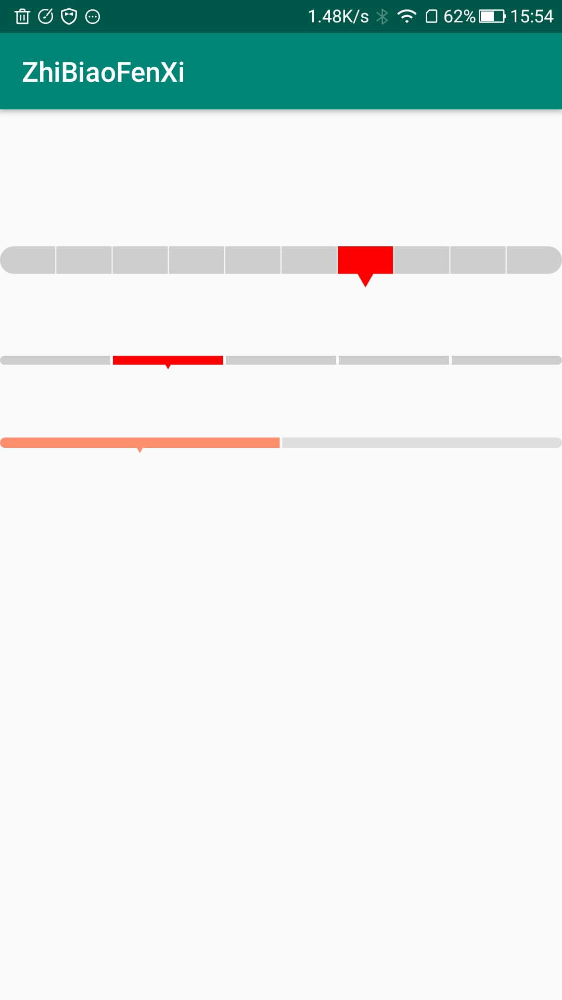

# JT_ZhiBiaoView 使用方法



### download 下载地址

```groovy
implementation project(path: ':zhibiaoview')
```

### use 使用方式

跟普通的view用法一样。

```xml
    <com.william.zhibiaoview.ZhiBiaoView
        android:layout_width="match_parent"
        android:layout_height="30dp"
        android:layout_gravity="center"
        app:normalColor="#cecece"
        app:scoreColor="#f00"
        app:score="7"
        android:layout_marginTop="100dp"/>
```

### attrs 参数

- normalScore：正常的值。
- score：实际的值。
- space：格子间距。
- normalColor：正常格子的颜色。
- scoreColor：得分格子的颜色。

### 对外提供的方法

- setNormalScore：设置正常的值
- setScore：设置实际的值
- setSpace：设置间距
- setNormalColor：设置普通格子的颜色
- setScoreColor：设置选中格子的颜色


